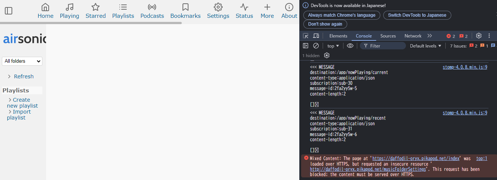

# Troubleshooting

## Cue sheet tracks do not end at the end of the track

See also [issue #195](https://github.com/kagemomiji/airsonic-advanced/issues/195)

If you have a cue sheet with multiple tracks, and you play a track which is not the last track, the client will continue to play the next track without ending. 

Please check the following settings.

`Settings` -> `Transcoding` -> `Downsample command`

To fix this, you need to add split option `%S` to the beginning of the command.

Before: `ffmpeg -i %s -map 0:0 -b:a %bk -v 0 -f mp3 -`

After: `ffmpeg %S -i %s -map 0:0 -b:a %bk -v 0 -f mp3 -`

## WEB UI does not work over HTTPS

If you see some blank pages in the WEB UI or the Settings page does not work, launch your web browser's `development tool`, go to the `console tab`, and check for error messages that start with `Mixed content ...`.

If you deploy Airsonic Advanced behind reverse proxies, please add `-Dserver.forward-headers-strategy=native` or `-Dserver.forward-headers-strategy=framework` to `JAVA_OPTS`.

