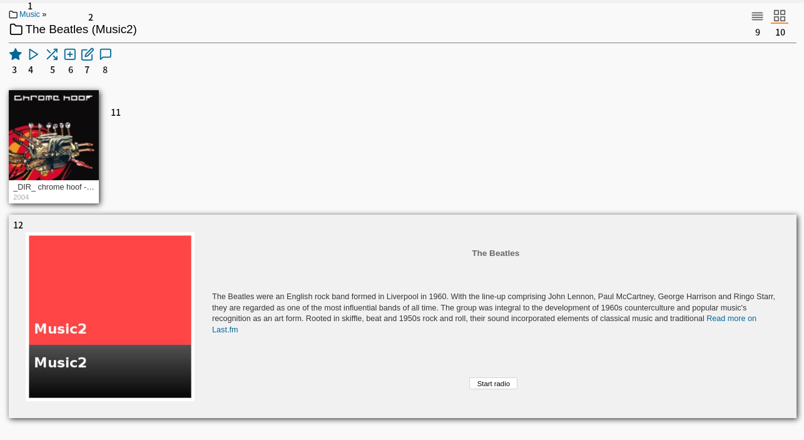
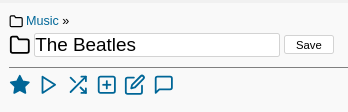

# Media

The media section of the web UI allows you to browse and play your music.

## Artist

### Artist View

| Number | Description | Role |
| --- | --- | --- |
| 1 | Parent Directory Links. You can click on the name to navigate to the parent directories. | User |
| 2 | Artist name. If you edit the artist name, the original name will be displayed in `( )`. | User |
| 3 | Star. You can click on the star to add the artist to your favorites. | User |
| 4 | Play. You can click on the play button to play all songs by the artist. | User |
| 5 | Shuffle. You can click on the shuffle button to shuffle all songs by the artist. | User |
| 6 | Add to player. You can click on the add to player button to add all songs by the artist to a player. | User |
| 7 | Edit artist. You can click on the edit artist button to edit the artist name. | CoverArt |
| 8 | Comment. You can click on the comment button to add a comment to the artist. | Comment |
| 9 | List view. You can click on the list view button to switch to the list view. | User |
| 10 | Grid view. You can click on the grid view button to switch to the grid view. | User |
| 11 | Albums. You can see the albums by the artist. | User |
| 12 | Artist Information. You can see the artist information from Last.fm. | User |

### Edit Artist

1. Click on the edit artist button.
2. Edit the artist name.
3. Click on the save button.

If you want to cancel, click on the Edit Artist button again.  
To update the search results, performing a library rescan is necessary, but a full scan is unnecessary.

## Related Documentation

- [Media/Rule](../media/rule.md)