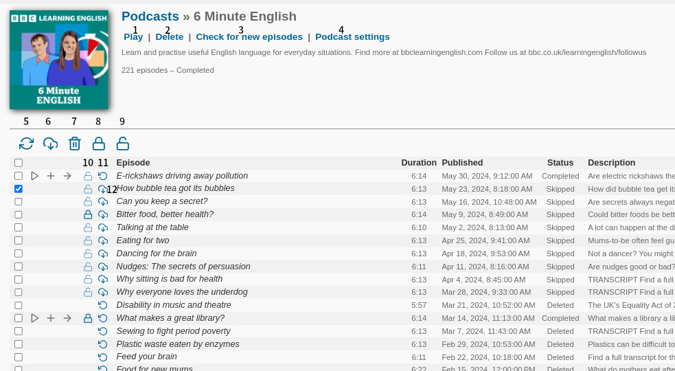

# Podcast

## Podcast Channel

| Number | Description | Role | 
| --- | --- | --- |
| 1 | Play the podcast channel | User |
| 2 | Delete the podcast channel | Podcast |
| 3 | Retrieve the new episode lists | Podcast |
| 4 | Configure the podcast channel rule | Admin |
| 5 | Refresh Page | User |
| 6 | Download selected episodes. This becomes visible when at least one checkbox is checked.| Podcast |
| 7 | Delete selected episodes.  This becomes visible when at least one checkbox is checked. | Podcast |
| 8 | Lock selected episodes. Locked episodes will be prevented from being deleted and will not be counted in the 'Keep X latest episodes' rule.  This becomes visible when at least one checkbox is checked. | Podcast |
| 9 | Unlock selected episodes.  This becomes visible when at least one checkbox is checked. | Podcast |
|10 | Lock/Unlock each episode. Locked episodes will be prevented from being deleted and will not be counted in the 'Keep X latest episodes' rule. | Podcast |
|11 | Reset episode status to 'New' for re-downloading. If the episode is marked as 'Deleted', it will be locked to prevent deletion. | Podcast |
|12 | Download each episode. | Podcast |
